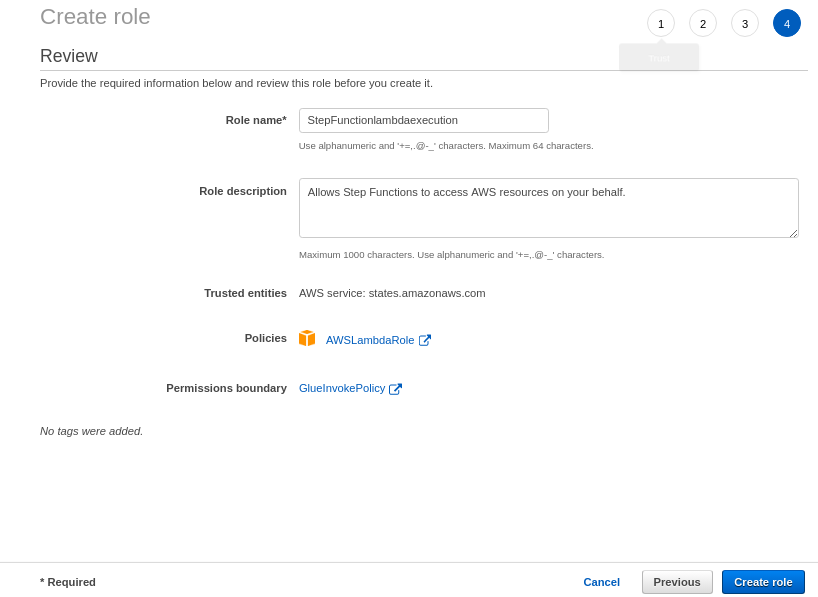

###############################################
AWS Step Function with AWS Lambda and AWS Glue
###############################################

AWS Step Functions is a web service that enables you to coordinate the components of distributed applications and microservices 
using visual workflows.

Step Functions offers a graphical console to visualize the components of your application as a series of steps. It automatically
triggers and tracks each step, and retries when there are errors, so your application executes in order and as expected, every 
time. Step Functions manages the operations and underlying infrastructure for you to ensure your application is available at 
any scale.

Steps to Create Step Function
------------------------------

Step 1 - Create a state machine.
+++++++++++++++++++++++++++++++++

- select ``Get Started`` from console.

   
- Define the state and click next 

   
Step 2 - Configure your state machine
++++++++++++++++++++++++++++++++++++++

- Create IAM role - Select role from IAM console

   
- Click on ``Create Role``

   
- Sletect ``Step Function`` as a AWS service and click on ``Next:Permission``

- Attach new created policies to step function. Click on ``Create Policy``.

   
- Review and Save the policy and click the ``Next:Tags``.

1) LambdaInvokePolicy

.. code-block:: json

   {
    "Version": "2012-10-17",
    "Statement": [
        {
            "Sid": "VisualEditor0",
            "Effect": "Allow",
            "Action": [
                "lambda:CreateFunction",
                "lambda:InvokeFunction",
                "lambda:GetLayerVersion",
                "lambda:GetEventSourceMapping",
                "lambda:ListTags",
                "lambda:GetFunction",
                "lambda:GetAccountSettings",
                "lambda:GetFunctionConfiguration",
                "lambda:GetAlias",
                "lambda:GetLayerVersionPolicy",
                "lambda:GetPolicy"
            ],
            "Resource": "*"
          }
        ]
   }
     
2) GlueInvokePolicy

.. code-block:: json

   {
     "Version": "2012-10-17",
     "Statement": [
         {
             "Sid": "VisualEditor0",
             "Effect": "Allow",
             "Action": "glue:*",
             "Resource": "*"
          }
        ]
     }
     
- Attache the policies to role 

- review and name the role and create it.

   
- Configure the state machine with the created role as follows

- DashBoard is looks like this.

Step 3 - Start new execution as follow.
++++++++++++++++++++++++++++++++++++++++

- Click on state machine which you created and then click on ``Start Execution``

- See the flowchart of tasks mentioned in the step function

   
- once you start execution your connected lambda function and glue job started running

